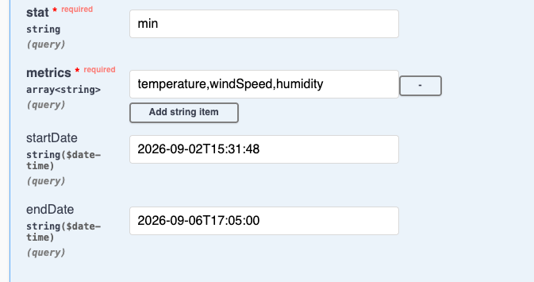

(Also see [APPROACH.md](./APPROACH.md))

# Running the app

1. Run 
`mvn clean install` to build the app and run all tests
2. Run `docker compose up` to start the Postges database
3. Run the app through IntelliJ or `mvn spring-boot:run`
4. Navigate to http://localhost:8080/swagger-ui/index.html or hit the API manually

# Usage/Endpoints

## Create New data (POST)

Hit the `/weather{id}` endpoint to create a new statistic of the JSON request structure:

```
{
  "temperature": 0,
  "humidity": 10.0,
  "windSpeed": 1,
  "timestamp": "2026-09-06T14:51:16.704Z"
}
```
where `{id}` is the sensor ID you are creating the data for (this field is required).

### Restrictions

* Temperature cannot be null
* Humidity must be greater than or equal to 0
* wind speed must be greater than or equal to 0

## Query existing data (GET)

Hit the `/weather` endpoint to query existing statistics data for the sensors.

The parameters for the endpoint are:
* stat : String - can only be one of the following values (min,max,average,sum)
* metrics : String[] - can be one or many of the following values in a comma separated list (temperature,windSpeed,humidity)
* startDate : Date - the start date to query from - in the form - `2026-09-02T15:31:48`
* endDate : Date - the end date to query from - in the form - `2026-09-04T15:31:48`

### Restrictions

* Include startDate and endDate or neither. Omitting both will give the latest data (yesterday's data)
* The startDate must be within a month ago
* The endDate cannot be within the last day (<strong>Note:</strong> Post data with a timestamp within this range to query your own data efficiently.)
* Invalid stat, metrics will generate an error

Sample swagger inputs for example:
* 

The (encoded) URL is of the form:

`/weather?stat=min&metrics=temperature%2CwindSpeed%2Chumidity&startDate=2026-09-02T15%3A31%3A48&endDate=2026-09-06T17%3A05%3A00`


### Restrictions

* Temperature cannot be null
* Humidity must be greater than or equal to 0
* wind speed must be greater than or equal to 0